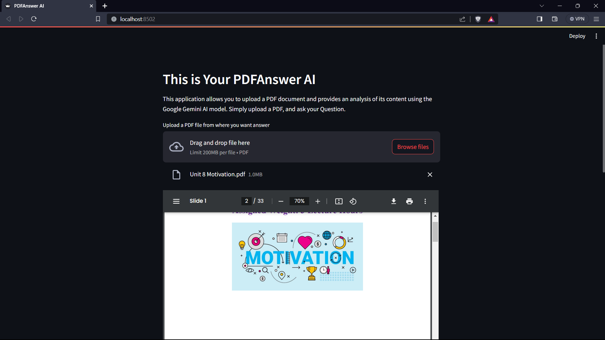

# PDFAnswer AI

## Overview
PDFAnswer AI is a Streamlit-based web application designed to analyze PDF documents using Google's Gemini AI model. It allows users to upload PDF files and ask questions, providing AI-generated insights and answers based on the content of the uploaded document.

## Features
- Upload PDF documents for analysis.
- Enter questions or prompts related to the PDF content.
- AI-powered analysis and response generation using Google Gemini AI.

## Setup and Installation
1. Clone the repository.
2. Install necessary Python packages:
3. Set up a `.env` file with your Google API key:
4. Run the Streamlit app:

## Usage
1. Start the application and navigate to the provided URL.

2. Upload a PDF document.

3. Enter a question or prompt related to the PDF.

4. Click "Proceed with your question" to analyze.

5. View the AI-generated insights and answers.

## Output
The application provides a user-friendly interface to upload PDF documents and enter questions. Upon uploading a PDF and asking a question, the app utilizes the Gemini AI model to analyze the document's text and generate relevant answers. The output is displayed under the "Analysis Result" section in a clear and readable format.

## License
[MIT License](LICENSE.md)

## Disclaimer
This application is for educational and demonstration purposes only. Please do not upload sensitive or proprietary information.
